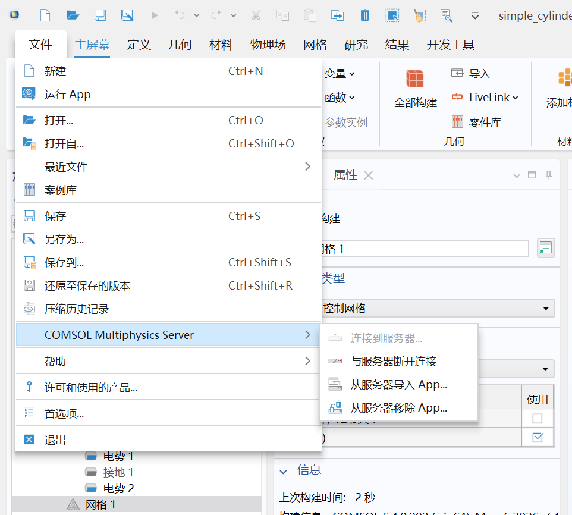
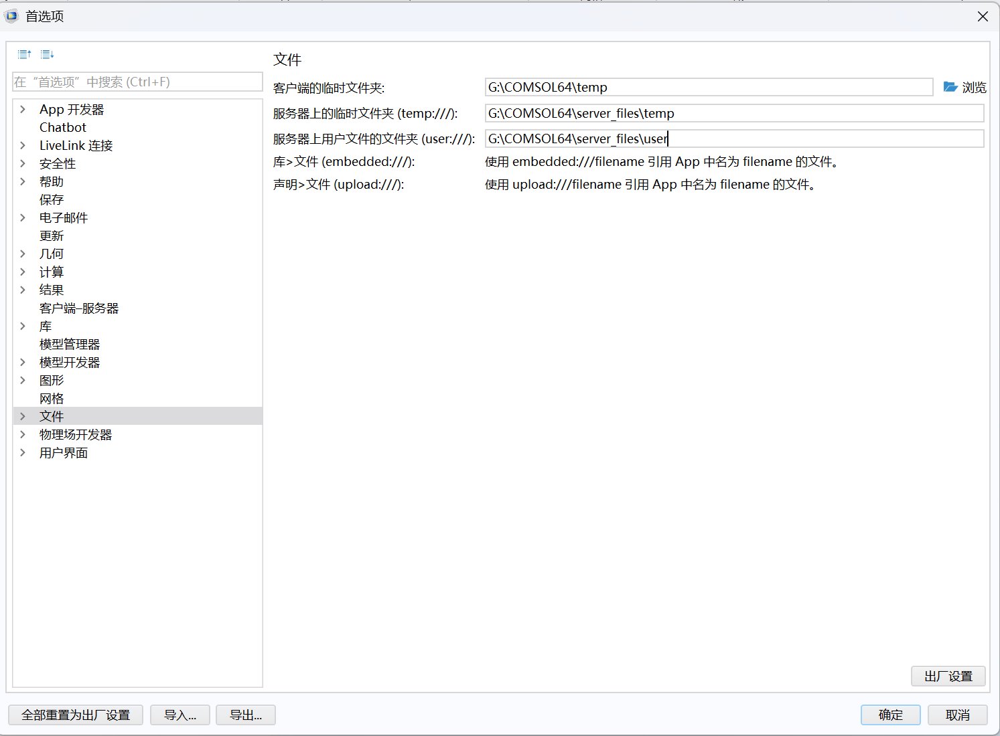

# Codex 接入 COMSOL 并实现近实时双向协作教程

本文档记录当前项目已经跑通的 COMSOL + Python `mph` + Codx 工作流。

目标是实现一个稳定的共享 Session：

- COMSOL GUI 负责可视化查看、手动微调、保存文件。
- Codex 通过 Python/mph 连接同一个本地 COMSOL Server。
- Codex 可以读取 GUI 当前打开模型的内存状态。
- Codex 可以修改参数、重建几何、求解、修正绘图配置。
- GUI 可以看到 Codex 对 server 内模型对象做出的修改。

## 0. 准备工作

- 安装 COMSOL Multiphysics 6.4 或较新的版本（需要有 COMSOL Server）。
- 安装 Python 3.10+。
- 安装 VS Code 和 Codex 插件。（codex桌面端、codexCLI、CC应该都行，我用的是vscode的codex插件）我用的gpt5.5
- 稳定的魔法

## 1. 安装依赖

安装 `mph` Python 包。
直接交给codex。
prompt：

帮我在当前项目根目录（我的是G:\COMSOL64\usr）创建虚拟环境，如果有uv用uv，如果没有就用python -m venv。然后安装mph包。

不用怕以后运行会有没安装的包，codex直接帮忙装好

## 2. 打开本地服务器

prompt:
（此处复制你的comsol安装路径）写一个脚本start_server.bat 运行comsolserver, 一定要是多客户端模式（ -multi on -port 2036）

运行：

```bat
"G:\COMSOL64\Multiphysics\bin\win64\comsolmphserver.exe" -multi on -port 2036
```

必须使用 `-multi on`，否则 GUI 连接后，Python/mph 作为第二个客户端会报：

```text
Server is in use by another client
```

## 3. GUI 连接本地 Server

在 COMSOL GUI 中连接本地 server：



然后在 GUI 里打开模型

注意这里最好在文件-首选项里修改一下文件位置，因为默认在C盘



## 4. VS Code / Codex 连接当前 GUI 模型

GUI 修改不会修改 Python 文件。GUI 修改的是：

```text
COMSOL Server 内存中的模型对象
```

Codex/Python 连接同一个 server 后，通过脚本命令读取这个模型对象。

直接让codex写共享session的python脚本就行了。

prompt：写一个共享session脚本，生成一个简单的圆柱形模型

```
import mph
client = mph.Client(version="6.4", port=2036)
models = client.models()
```

## 5. 文件锁问题怎么避免

COMSOL 的 `.mph` 文件锁主要来自两类情况：

1. GUI 正在打开该文件。
2. COMSOL Server 里残留了绑定该文件的模型对象。

如果 Python 用 `client.load("simple_cylinder.mph")` 打开文件，再 `model.save()` 覆盖同一个文件，而 GUI 同时打开该文件，就容易报：

```text
无法保存模型。文件 'simple cylinder.mph' 已被其他模型锁定。
```

推荐规则：

- 共享 Session 操作时，不让 Python 保存文件。
- Python 只操作 server 当前模型对象。
- 最终由 GUI 保存。
- 如果必须由 Python 生成新模型文件，保存后立即 `client.remove(model)`。

清理 server 中残留模型对象：

```powershell
uv run python clear_simple_cylinder_models.py
```

查看 server 当前模型：

```powershell
uv run python list_server_models.py
```

如果 `.mph.lock` 文件仍被占用，说明 GUI 或 server 仍持有文件句柄。此时需要在 GUI 中关闭对应模型标签页，或断开/重连 server。

## 6. 工作流

### 近实时 GUI 协作

```text
1. 运行 start_server.bat
2. GUI 连接 
3. GUI 打开 simple_cylinder.mph（你创建的文件）
4. Codex 通过 shared_session.py 修改参数/物理/绘图/求解
5. GUI 修改、手动保存
```

## 7. 核心文件

```text
start_server.bat
```

用于启动 `-multi on` 的 COMSOL Server。当前共享 Session 必需。

```text
shared_session.py
```

用于codex 操控
